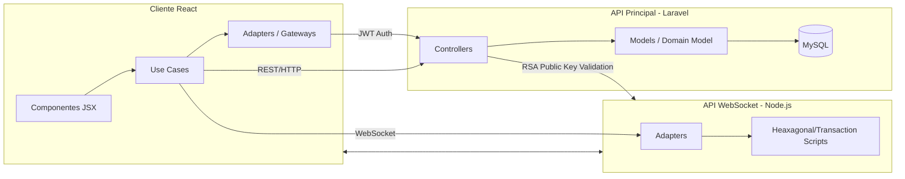
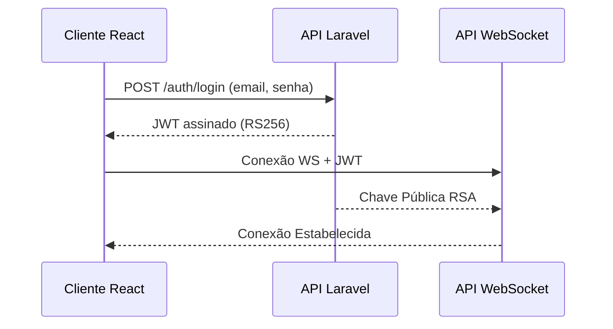
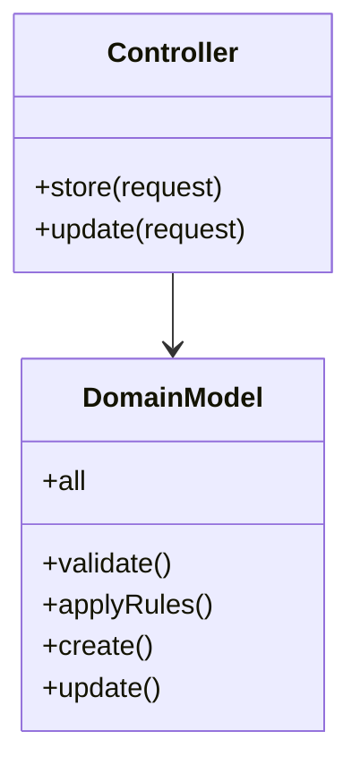
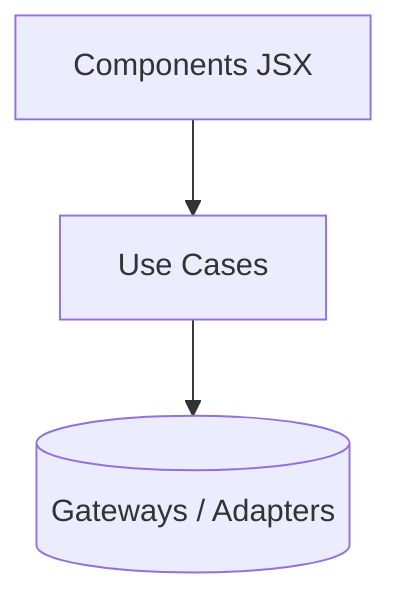
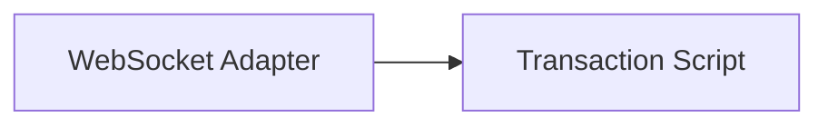
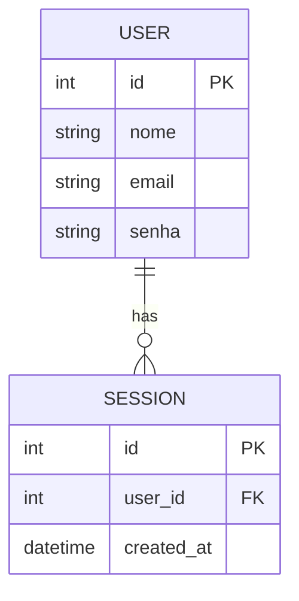

# Arquitetura do Sistema

## 📐 Visão Geral da Arquitetura

O sistema é dividido em três serviços independentes que se comunicam entre si:

* **API Principal (Laravel + MySQL)**

  * Responsável pela autenticação (JWT com RSA), regras de negócio e persistência.
  * Segue arquitetura MVC do Laravel com Domain Models aplicando regras específicas.
* **Cliente Web (React)**

  * Aplicação SPA estruturada em camadas de apresentação (componentes JSX) e camada de casos de uso (use cases) com inversão de dependência.
* **API WebSocket (Node.js)**

  * Gerencia comunicação em tempo real.
  * Segue uma variante simples de arquitetura Hexagonal com Transaction Scripts.

---

## 🌐 Diagrama Geral da Arquitetura

---

## 🔐 Autenticação e Segurança

A autenticação ocorre exclusivamente na **API Principal (Laravel)**.

* O usuário envia credenciais e recebe um **JWT assinado com RSA (RS256)**.
* A API expõe sua **chave pública** para os outros serviços.

  * O WebSocket usa essa chave pública para validar tokens.
  * O cliente React envia o JWT para ambos os serviços (API + WebSocket).

---

## 🧱 API Principal (Laravel)

### Padrões Utilizados

* **MVC** tradicional do Laravel
* **Controller** incopora application business rule e componentes externo
* **Domain Model** incorporado dentro da camada de Model

### Componentes

---

## 🖥 Cliente Web (React)

### Organização em Camadas

* **Presentation (JSX Components)**

  * Interfaces visuais.
* **Use Cases**

  * Contêm lógica de aplicação.
  * Não conhecem detalhes técnicos (HTTP, WS...)
* **Infra / Adapters**

  * Implementações concretas (APIs, WebSocket, LocalStorage).
  * Injetados nos use cases.

### Benefícios

* Testabilidade elevada
* Baixo acoplamento com tecnologias
* Facilidade de substituir HTTP por WebSocket ou RPC

---

## 🔌 API WebSocket (Node.js)

### Arquitetura

Seguindo estilo **Hexagonal simples** baseado em Transaction Scripts.

* **Adapters**: recebem mensagens WS
* **Transaction Scripts**: implementam ações diretas e regras de negocio (ex: enviar mensagem, notificar evento, criar chat)

### Responsabilidades

* Validar token JWT usando chave RSA
* Notificar eventos em tempo real
* Consumir APIs da API Principal quando necessário

---

## 🗄 Banco de Dados (MySQL)

A API principal utiliza MySQL com migrations. O modelo é normalizado de acordo com as entidades da regra de negócio.

Exemplo genérico:

---

## 🧪 Fluxo de Desenvolvimento

### Backend Laravel

* Controllers chamam Models
* Models valida regras e presiste

### React

* Use Case orquestra a regra
* Component recebe dados e renderiza

### WebSocket API

* Adapter recebe evento
* Transaction Script executa ação

---

## 📦 Deploy & Infraestrutura

* Cada serviço é independente
* API Laravel roda separada da API WebSocket
* Cliente React é hospedado como estático (S3, Vercel, etc.)
* Comunicação segura via HTTPS/WSS

---

## ✔ Benefícios da Arquitetura

* Independência entre serviços
* Escalabilidade individual (especialmente WebSocket)
* Separação clara de responsabilidade
* Código altamente testável
* Facilidade de evoluir para microservices, RPC, GRPC etc.

---