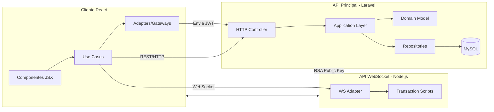
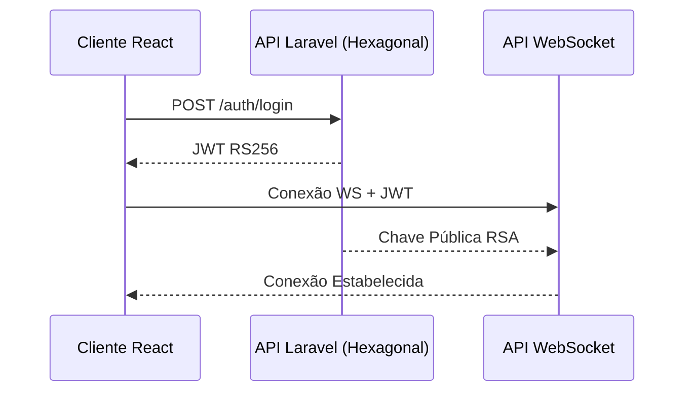
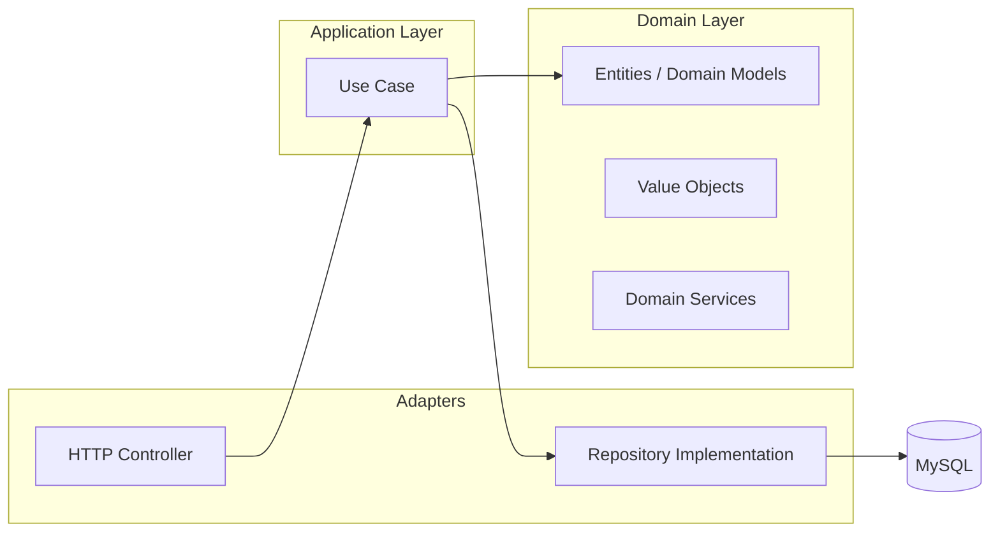
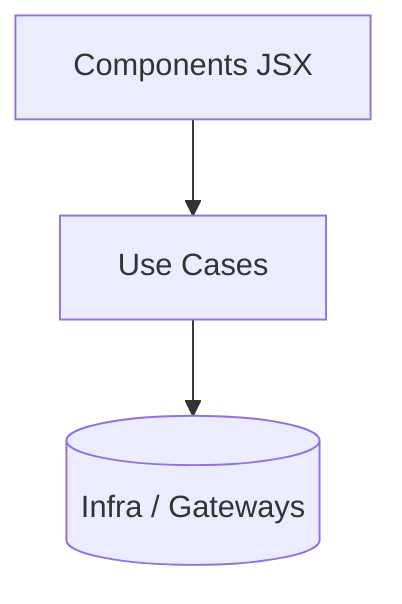
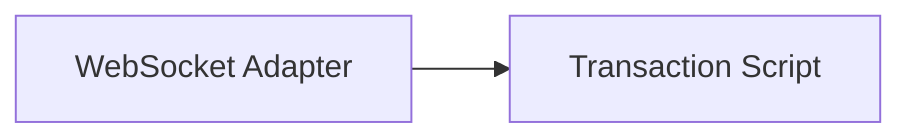
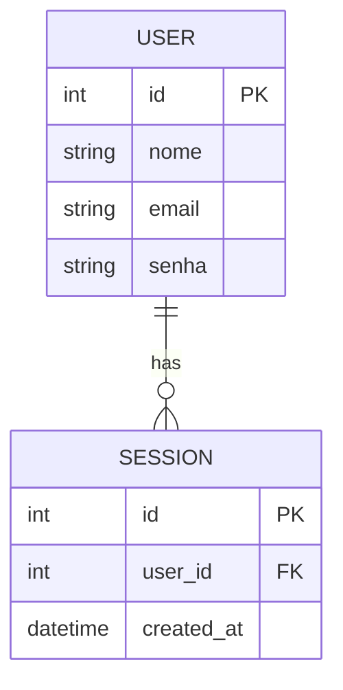

# Arquitetura do Sistema

## 📐 Visão Geral da Arquitetura

O sistema é composto por três serviços independentes:

* **API Principal (Laravel + MySQL)**

  * Agora segue **Arquitetura Hexagonal (Ports & Adapters)**.
  * Toda regra de negócio reside na **Camada de Domínio** (Domain Model + Aggregates + Policies).
  * A Application Layer contém **Casos de Uso** que orquestram o fluxo.
  * O Laravel funciona apenas como **Adapter de Entrada (HTTP)** + **Adapter de Persistência (Repositories)**.

* **Cliente Web (React)**

  * SPA estruturada em camadas de apresentação, use cases e adaptação de tecnologias.
  * Use Cases independentes de React, HTTP ou WebSocket.

* **API WebSocket (Node.js)**

  * Segue um design semelhante ao Hexagonal simplificado com Transaction Scripts.
  * Foca em tempo real, validação JWT e broadcasting.

---

## 🌐 Diagrama Geral da Arquitetura



---

## 🔐 Autenticação e Segurança

A autenticação ocorre exclusivamente na **API Hexagonal em Laravel**.

* O usuário envia credenciais para um **Controller → Caso de Uso → Domain Model**.
* O caso de uso retorna um **JWT assinado com RSA (RS256)**.
* A API disponibiliza sua **chave pública** para validação em serviços externos.
* O WebSocket valida tokens usando a chave pública.



---

## 🧱 API Principal (Laravel com Arquitetura Hexagonal)

### 📦 Estrutura de Camadas

A API é organizada em:

* **Adapters (Entrada/Saída)**

  * HTTP Controllers
  * Repositories (Eloquent ou Query Builder)
  * Providers / Serializers

* **Application Layer (Use Cases)**

  * Orquestram lógica
  * Não conhecem detalhes de infra
  * Input/Output boundaries

* **Domain Layer**

  * Domain Models
  * Rules / Policies
  * Entities
  * Value Objects
  * Domain Services
  * Totalmente puro: sem Laravel, sem DB, sem HTTP

### 🏗 Diagrama Hexagonal Simplificado



### Benefícios da nova estrutura

* Domínio independente do framework
* Use Cases totalmente testáveis
* Fácil trocar HTTP por RPC, CLI ou WS
* Repositórios podem ser trocados sem afetar domínio

---

## 🖥 Cliente Web (React)

### Organização em Camadas

* **Presentation (JSX)**
* **Use Cases**

  * total desacoplamento de biblioteca
  * orquestram chamadas para REST ou WS
* **Infra / Adapters**

  * HTTP (fetch/axios)
  * WebSocket
  * LocalStorage
  * Gateways para API Laravel + WS



### Benefícios

* Testabilidade alta
* Fácil trocar HTTP por WebSocket
* Zero dependência direta de axios ou libs no componente

---

## 🔌 API WebSocket (Node.js)

### Arquitetura

* **Adapters WS**

  * Recebem mensagens, parse, validação
* **Transaction Scripts**

  * Executam ações específicas (ex: criar sala, enviar mensagem)
  * Validam token usando chave RSA
  * Podem consultar a API Laravel quando necessário



---

## 🗄 Banco de Dados (MySQL)

A persistência fica no Adapter de Saída:

* Repositories implementam interfaces definidas no domínio
* Domain não conhece Eloquent
* DB pode ser trocado por Redis, DynamoDB, etc.

Exemplo genérico:



---

## 🧪 Fluxo de Desenvolvimento (Hexagonal)

### Laravel (API Principal)

* Controller → Caso de Uso → Domínio → Repositório
* Domínio nunca toca framework
* Casos de uso concentram fluxo

### React

* Use Case orquestra
* Component só renderiza

### WebSocket

* Adapter recebe evento
* Transaction Script executa ação

---

## 📦 Deploy & Infraestrutura

* Cada serviço é independente (micro frontends + micro APIs)
* Laravel isolado
* Node WebSocket isolado
* React hospedado como estático
* Comunicação segura via HTTPS / WSS

---

## ✔ Benefícios da Arquitetura

* Máxima separação de responsabilidades
* Domínio isolado e puro
* Testes unitários fáceis (Application + Domain)
* Serviços escaláveis individualmente
* Fácil evolução para microservices, RPC e mensageria

## Estrutura de pasta
```
app/
  Domain/
  Application/
  Infrastructure/
  Http/
```