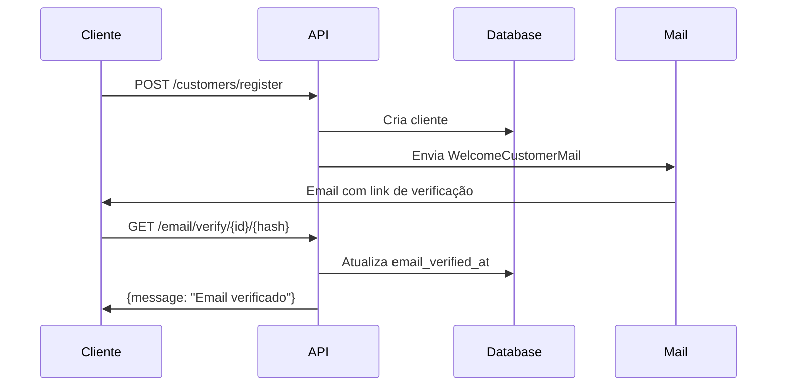

# 📧 Email Verification Setup

## Configuração Implementada

### ✅ Componentes Criados:

1. **Mailables** (`app/Infrastructure/Mail/`)
   - `WelcomeCustomerMail.php` - Email para clientes
   - `WelcomeOperatorMail.php` - Email para operadores

2. **Templates Blade** (`resources/views/emails/`)
   - `customer-welcome.blade.php` - Template HTML para clientes
   - `operator-welcome.blade.php` - Template HTML para operadores

3. **Controller** (`app/Http/Controllers/Api/Auth/`)
   - `EmailVerificationController.php` - Verifica e reenvia emails

4. **Rotas Públicas** (não precisam autenticação):
   ```
   GET  /api/v1/email/verify/{id}/{hash}?type=customer  - Verificar email
   POST /api/v1/email/resend                             - Reenviar email
   ```

---

## 🔑 Configuração do Email

### 🎯 Configuração Profissional de Email

O sistema está configurado para usar **serviços SMTP profissionais** que funcionam para qualquer cliente.

---

## 📧 **DESENVOLVIMENTO (Recomendado para testes)**

### Mailtrap - Ambiente de Testes Seguro

**Por que usar:** Intercepta todos os emails sem enviar para endereços reais. Perfeito para desenvolvimento.

**Como configurar:**

1. **Cadastre-se gratuitamente:** https://mailtrap.io
2. **Acesse:** Email Testing → Inboxes → Show Credentials
3. **Copie as credenciais SMTP**
4. **Cole no `.env`:**

```env
MAIL_MAILER=smtp
MAIL_HOST=sandbox.smtp.mailtrap.io
MAIL_PORT=2525
MAIL_USERNAME=seu_username_aqui
MAIL_PASSWORD=sua_senha_aqui
MAIL_ENCRYPTION=tls
MAIL_FROM_ADDRESS="noreply@estacionamentouby.com.br"
MAIL_FROM_NAME="Estacionamento Uby"
```

5. **Reinicie:** `docker-compose restart backend`
6. **Teste:** Registre um cliente e veja o email no painel do Mailtrap

---

## 🚀 **PRODUÇÃO (Para enviar emails reais)**

### Opção 1: AWS SES (Recomendado) 💰 Mais barato

- ✅ **62.000 emails grátis/mês** (se hospedar na AWS)
- ✅ $0,10 por 1.000 emails depois
- ✅ Alta taxa de entrega
- ✅ Configuração via IAM

```env
MAIL_MAILER=smtp
MAIL_HOST=email-smtp.us-east-1.amazonaws.com
MAIL_PORT=587
MAIL_USERNAME=sua_aws_access_key
MAIL_PASSWORD=sua_aws_secret_key
MAIL_ENCRYPTION=tls
MAIL_FROM_ADDRESS="contato@seudominio.com.br"
MAIL_FROM_NAME="Estacionamento Uby"
```

**Setup:** https://docs.aws.amazon.com/ses/

---

### Opção 2: SendGrid ⚡ Mais simples

- ✅ **100 emails grátis/dia** (3.000/mês)
- ✅ Setup em 5 minutos
- ✅ Interface amigável
- ✅ Analytics incluído

```env
MAIL_MAILER=smtp
MAIL_HOST=smtp.sendgrid.net
MAIL_PORT=587
MAIL_USERNAME=apikey
MAIL_PASSWORD=SG.sua_api_key_aqui
MAIL_ENCRYPTION=tls
MAIL_FROM_ADDRESS="contato@seudominio.com.br"
MAIL_FROM_NAME="Estacionamento Uby"
```

**Setup:** https://sendgrid.com

---

### Opção 3: Mailgun 📬 Alternativa

- ✅ **5.000 emails grátis/mês**
- ✅ API REST robusta
- ✅ Logs detalhados

```env
MAIL_MAILER=smtp
MAIL_HOST=smtp.mailgun.org
MAIL_PORT=587
MAIL_USERNAME=postmaster@seu-dominio.mailgun.org
MAIL_PASSWORD=sua_senha_mailgun
MAIL_ENCRYPTION=tls
MAIL_FROM_ADDRESS="contato@seudominio.com.br"
MAIL_FROM_NAME="Estacionamento Uby"
```

**Setup:** https://mailgun.com

---

## ⚙️ Comparação de Serviços

| Serviço | Grátis | Preço Depois | Melhor Para |
|---------|--------|--------------|-------------|
| **Mailtrap** | Ilimitado (testes) | - | Desenvolvimento |
| **AWS SES** | 62k/mês | $0,10/1k | Produção (grande volume) |
| **SendGrid** | 100/dia | $19,95/mês (40k) | Startups |
| **Mailgun** | 5k/mês | $35/mês (50k) | APIs robustas |

---

## 🔒 **Importante para Produção:**

1. ✅ Use domínio próprio no `MAIL_FROM_ADDRESS`
2. ✅ Configure SPF, DKIM, DMARC no DNS
3. ✅ Verifique o domínio no serviço escolhido
4. ✅ Monitore taxa de bounce/spam
5. ✅ Use HTTPS no link de verificação

---

## 🧪 Como Testar

### 1. Registrar um novo cliente:
```bash
curl -X POST http://localhost:8000/api/v1/customers/register \
  -H "Content-Type: application/json" \
  -d '{
    "name": "Teste Cliente",
    "email": "ranielisilveira@hotmail.com",
    "cpf": "12345678900",
    "rg": "1234567",
    "password": "senha123",
    "password_confirmation": "senha123",
    "phone": "11999999999",
    "zip_code": "37890000",
    "street": "Rua Teste",
    "number": "123",
    "neighborhood": "Centro",
    "city": "Muzambinho",
    "state": "MG"
  }'
```

**O que acontece:**
- Cliente é criado
- Email de boas-vindas é enviado automaticamente
- Email contém link de verificação válido por 24h

### 2. Verificar se o email foi enviado:

**Se usando Mailtrap:** Verifique inbox no painel do Mailtrap

**Se usando Outlook:** Verifique sua caixa de entrada

**Se usando log:** 
```bash
docker-compose exec backend tail -f storage/logs/laravel.log
```

### 3. Clicar no link de verificação:

O link será algo como:
```
http://localhost:8000/api/v1/email/verify/1/abc123?type=customer&expires=...&signature=...
```

**Response esperada:**
```json
{
  "message": "Email verificado com sucesso! Você já pode fazer login.",
  "verified_at": "19/11/2025 10:30:00"
}
```

### 4. Reenviar email (se expirou):
```bash
curl -X POST http://localhost:8000/api/v1/email/resend \
  -H "Content-Type: application/json" \
  -d '{
    "email": "ranielisilveira@hotmail.com",
    "type": "customer"
  }'
```

---

## 📝 Fluxo Completo



---

## 🔒 Segurança

- ✅ Links são assinados digitalmente (signed routes)
- ✅ Hash do email é verificado
- ✅ Links expiram em 24 horas
- ✅ Verificação dupla: ID + Hash
- ✅ Logs de verificação

---

## 🎨 Conteúdo dos Emails

### Email do Cliente:
- 🎨 Design responsivo
- 📋 Dados do cadastro (nome, email, CPF)
- 🔗 Botão "Confirmar Email"
- ⚠️ Avisos importantes
- ⏰ Tempo de expiração (24h)

### Email do Operador:
- 🎨 Design verde (diferenciado)
- 📋 Dados do operador
- 🔐 Lista de permissões
- 🔗 Botão "Confirmar Email"

---

## ✅ Próximos Passos

1. **Adicione sua senha no `.env`:**
   ```bash
   nano backend/.env
   # Edite MAIL_PASSWORD=sua_senha_real
   ```

2. **Reinicie os containers:**
   ```bash
   docker-compose restart backend
   ```

3. **Teste o registro:**
   ```bash
   # Use o curl acima ou Postman/Insomnia
   ```

4. **Verifique os logs:**
   ```bash
   docker-compose exec backend php artisan tinker
   >>> \App\Infrastructure\Persistence\Models\Customer::latest()->first()
   ```

---

## 🐛 Troubleshooting

### Email não chega:
- Verifique MAIL_PASSWORD no .env
- Teste com Mailtrap primeiro
- Verifique spam/lixo eletrônico
- Veja logs: `docker-compose logs backend`

### Link de verificação não funciona:
- Verifique se APP_URL está correto no .env
- Link expira em 24h
- Use o endpoint `/email/resend` para gerar novo link

### Erro de autenticação SMTP:
- Se Outlook: gere uma senha de aplicativo
- Se Gmail: ative "apps menos seguros" ou use OAuth2

---

**Status:** ✅ Implementado e pronto para testes!
